# 🎪 부스 QR 스탬프 랠리


**부스 90여 개에 QR 한 장씩 붙여 두면, 방문객이 폰으로 찍을 때마다 도장이 쌓이는 행사용 웹앱.**
7개를 모으면 앱 안에서 설문에 답하고 교환권을 받아 운영본부에서 선물을 받습니다. 운영본부는 대시보드로 현장을 실시간으로 봅니다.

> 실제 수학·과학 축전(부스 95개, 하루 최대 5만 명)에 쓰인 앱의 공개 버전입니다. 부스명·기관명은 더미 데이터이고 Supabase 주소·키는 자리표시자입니다.

<p align="center">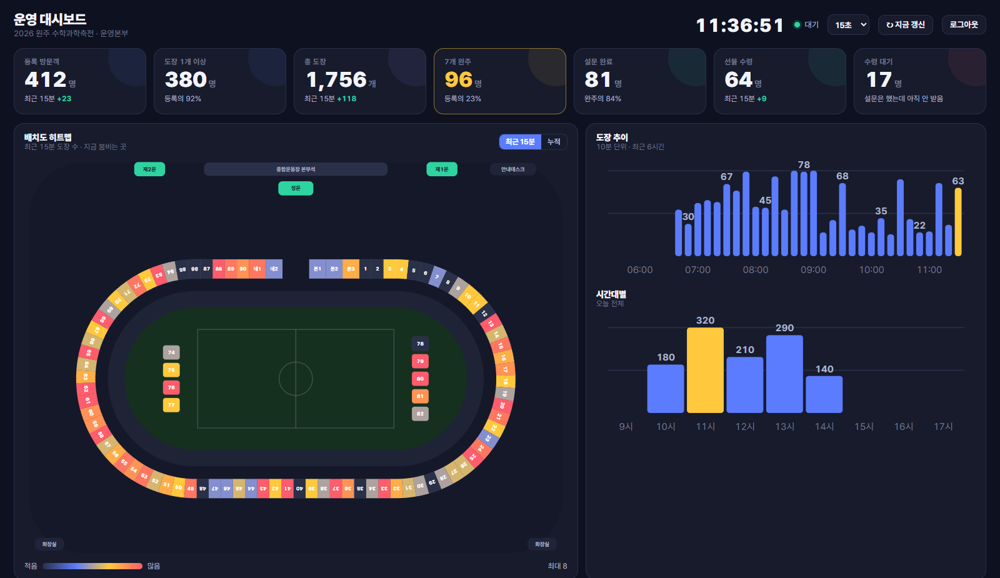</p>

## 왜 이렇게 만들었나

| 현장 조건 | 결정 |
|---|---|
| 방문객 수천 명, 앱 설치 요구 불가 | QR → 브라우저에서 바로. 파일은 HTML 하나 + JS 둘 |
| 예산 없음, 담당자가 개발자 아님 | Supabase 무료 플랜 + Vercel 정적. 행사 설정·부스·설문 문항은 관리자 화면에서 |
| 부스 측 인력이 없음 (도장 찍어줄 사람 없음) | 부스에 고정 QR만. 검증은 서버가: QR 마다 비밀 토큰 + 도장 간격 90초 |
| 미성년자 개인정보 | 이름·학교·학년·성별만. 익명 키로는 명단을 못 읽고 RPC 로만 |
| 운동장 통신 불안정 | 도장 실패·8초 초과 시 폰에 저장 후 자동 재전송 |
| 운영본부가 상황을 알아야 함 | 15초 갱신 대시보드: 어디가 붐비는지, 어느 QR 이 안 찍히는지 |

## 방문객 화면

<table>
  <tr>
    <td align="center">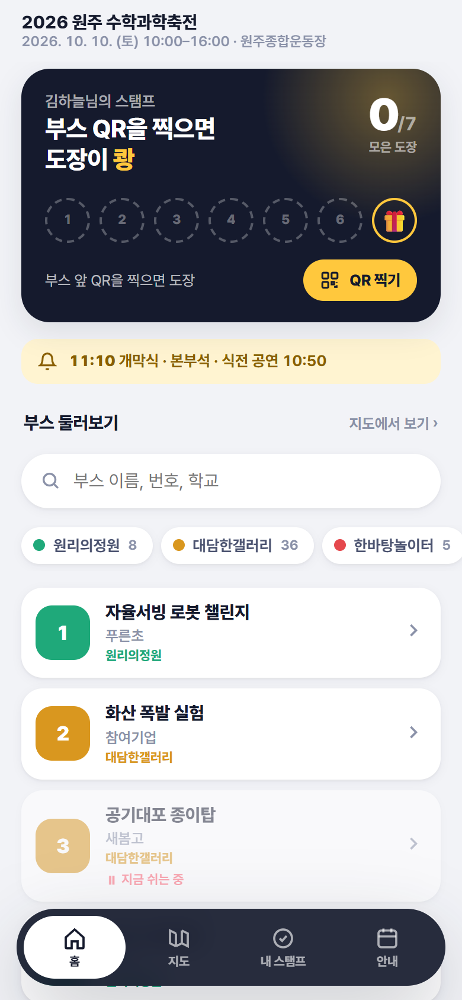<br><sub><b>홈</b><br>스탬프 카드·검색·분류</sub></td>
    <td align="center">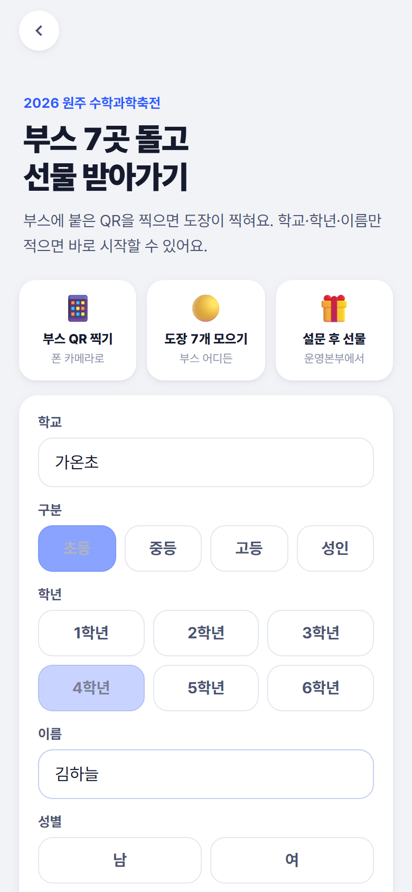<br><sub><b>등록</b><br>학교·학년·이름·성별</sub></td>
    <td align="center">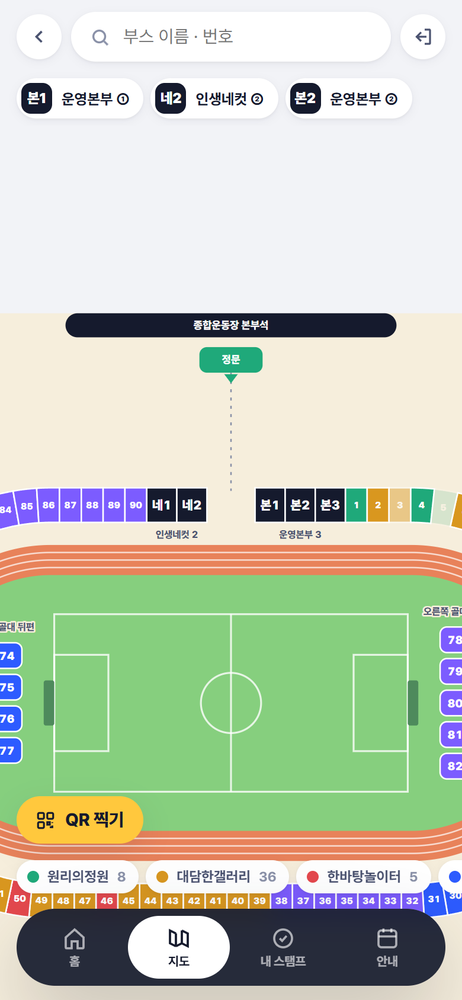<br><sub><b>지도</b><br>실제 배치도·핀치줌</sub></td>
    <td align="center">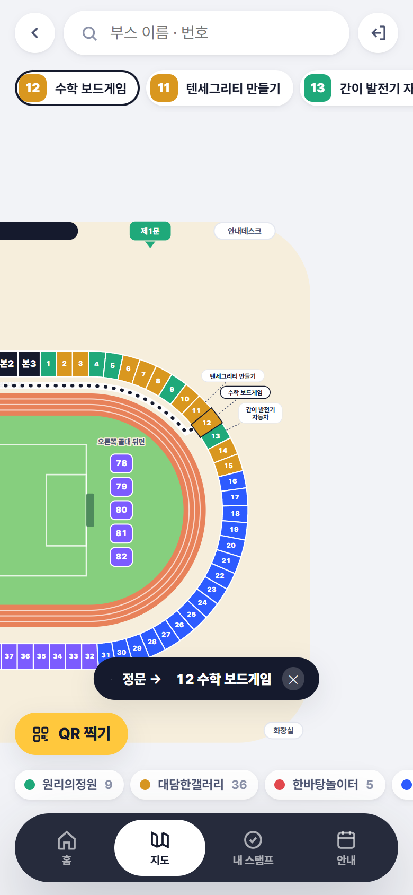<br><sub><b>가는 길</b><br>정문→부스, 가까운 출구</sub></td>
    <td align="center">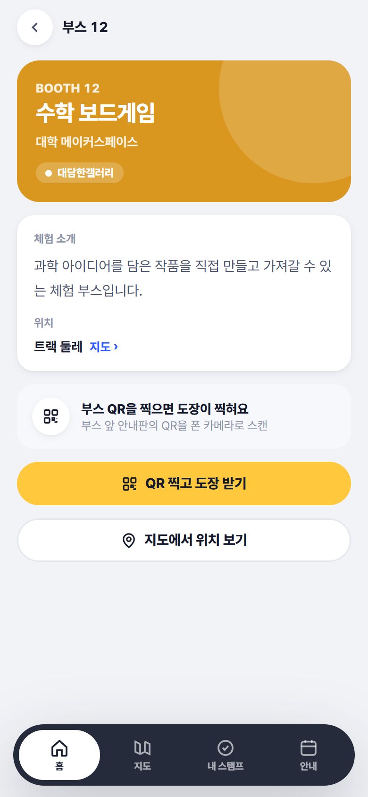<br><sub><b>부스 소개</b><br>영상·PDF·도장 상태</sub></td>
  </tr>
  <tr>
    <td align="center">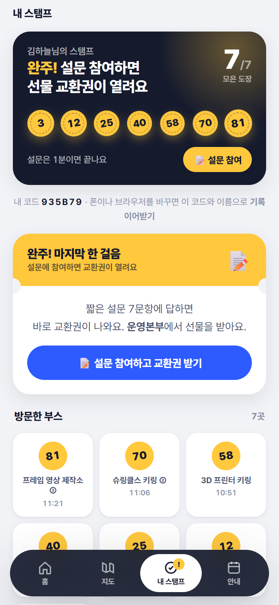<br><sub><b>완주</b><br>7개 모으면 설문 안내</sub></td>
    <td align="center">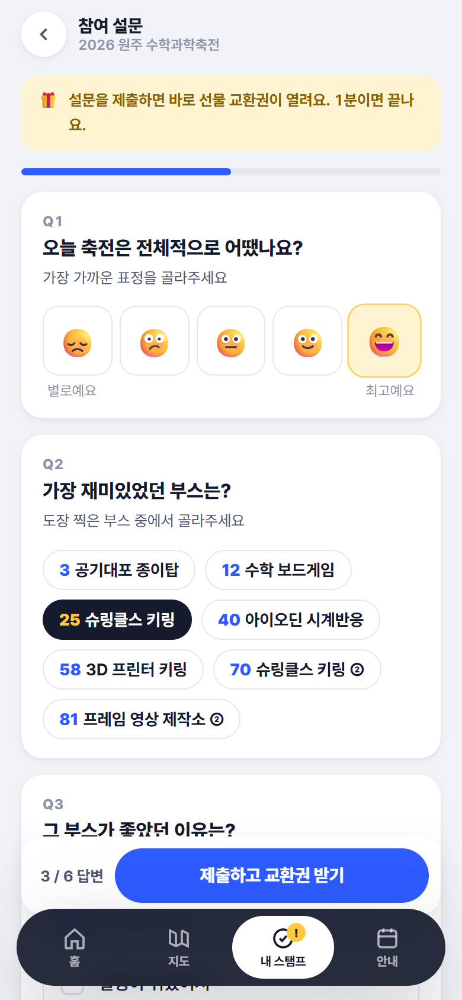<br><sub><b>앱 내 설문</b><br>표정·내 부스 고르기·객관식</sub></td>
    <td align="center">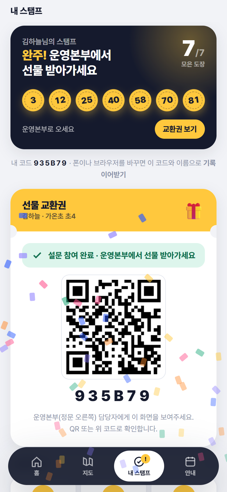<br><sub><b>교환권</b><br>제출 즉시 QR + 코드</sub></td>
    <td align="center" colspan="2">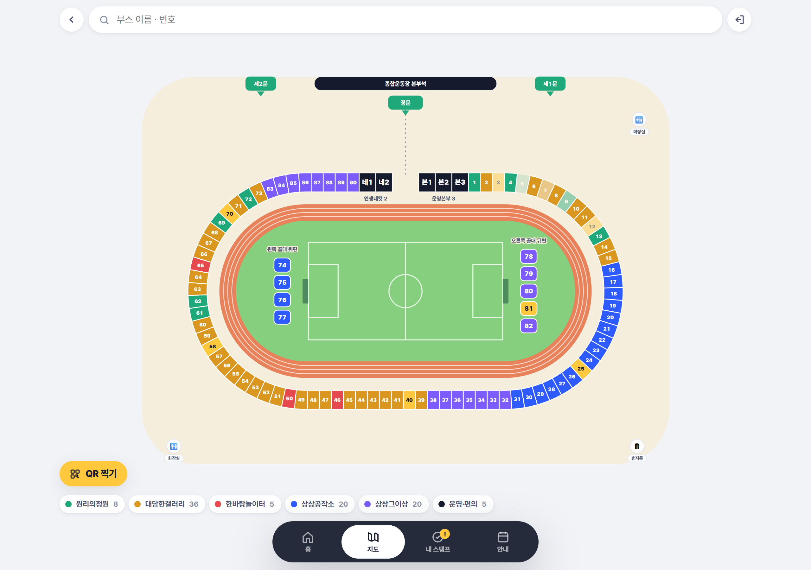<br><sub><b>지도 (PC)</b><br>부스 95개 전체, 확대하면 이름표</sub></td>
  </tr>
</table>

## 운영본부 화면

대시보드는 TV 에 띄워 두는 별도 페이지(`/dashboard`). 관리자 화면은 앱 안 `#/admin`.

<table>
  <tr>
    <td width="50%">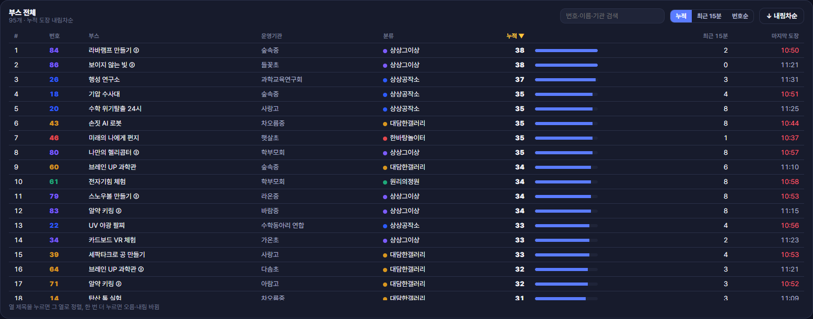<br><sub><b>대시보드 · 부스 전체 표</b> — 열 제목 정렬·검색, 30분 넘게 도장 없으면 빨강</sub></td>
    <td width="50%">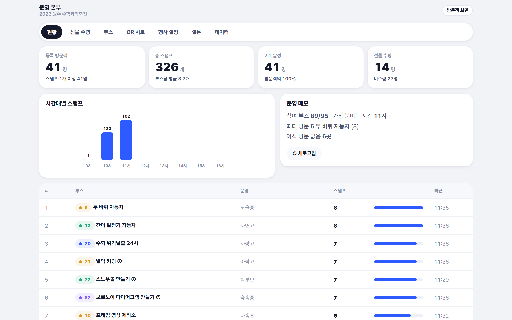<br><sub><b>관리자 · 현황</b> — 등록·도장·완주·수령, 시간대별, 부스별</sub></td>
  </tr>
  <tr>
    <td>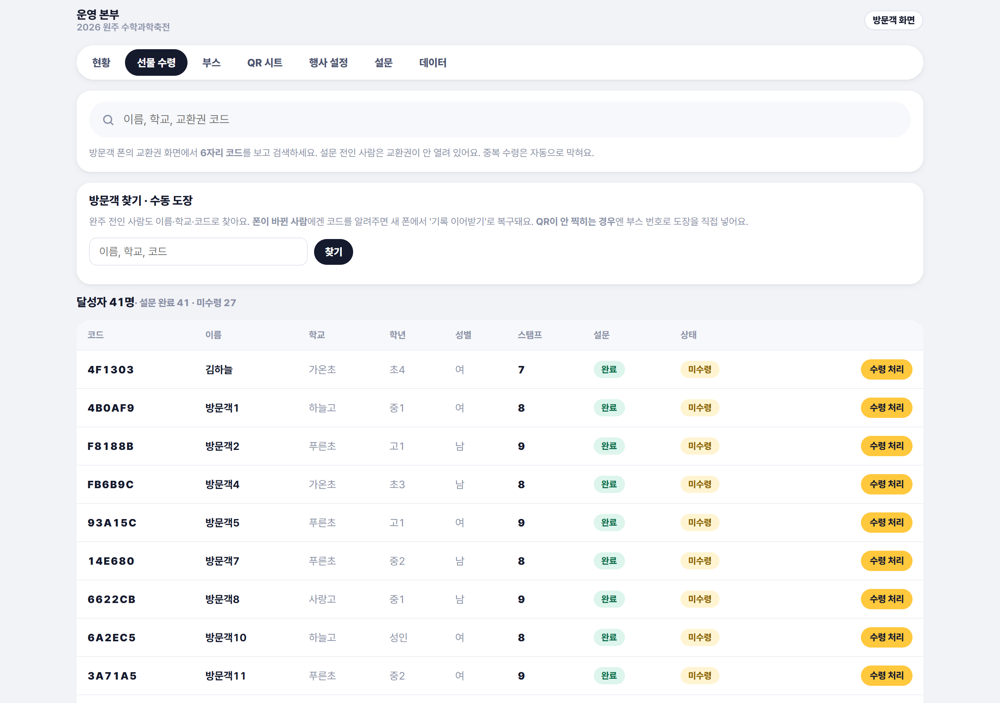<br><sub><b>선물 수령</b> — 교환권 QR 연속 스캔 또는 코드 검색으로 수령 처리, 방문객 찾기·수동 도장</sub></td>
    <td>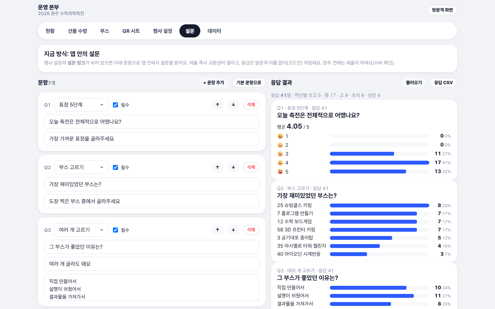<br><sub><b>설문</b> — 문항 편집(5가지 유형) + 결과 집계 + CSV</sub></td>
  </tr>
  <tr>
    <td>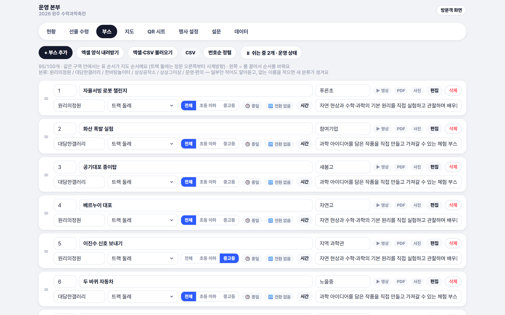<br><sub><b>부스</b> — 표 편집·순서·CSV·PDF/사진 업로드</sub></td>
    <td>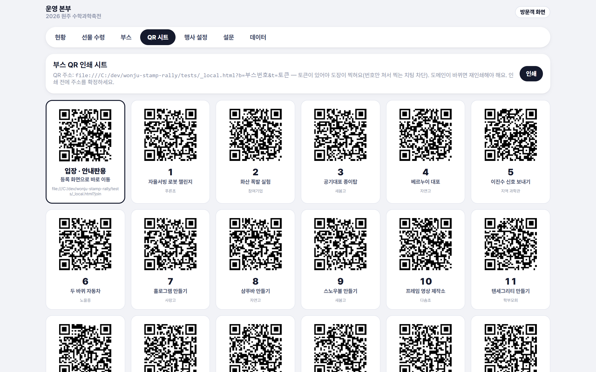<br><sub><b>QR 시트</b> — 부스별 토큰 포함 QR, A4 인쇄</sub></td>
  </tr>
  <tr>
    <td>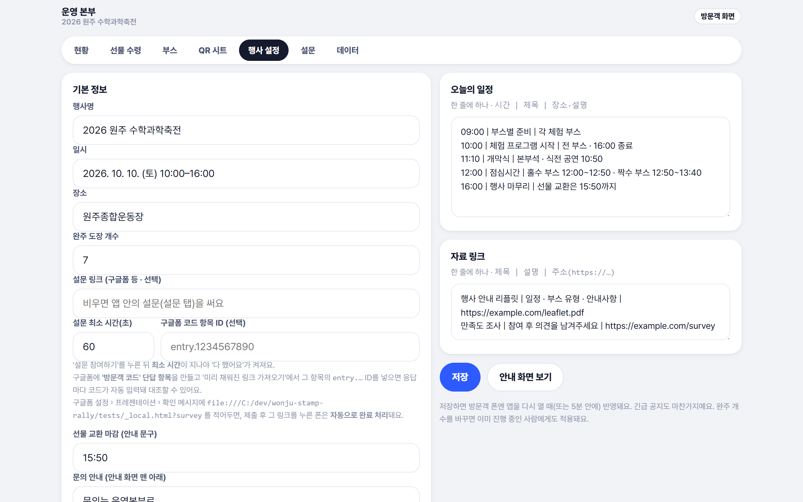<br><sub><b>행사 설정</b> — 행사명·완주 개수·설문·긴급 공지·일정, 열린 폰에 5분 내 반영</sub></td>
    <td>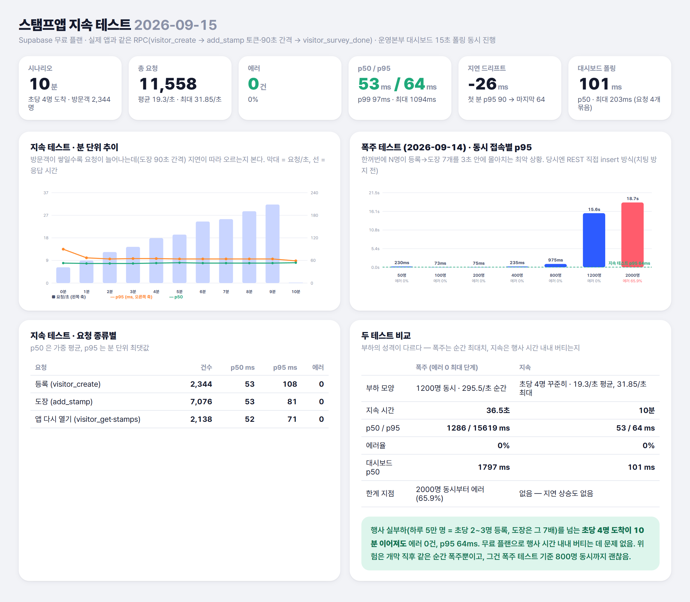<br><sub><b>지속 테스트</b> — 초당 4명 × 10분, 에러 0 · p95 64ms</sub></td>
  </tr>
</table>

## 흐름

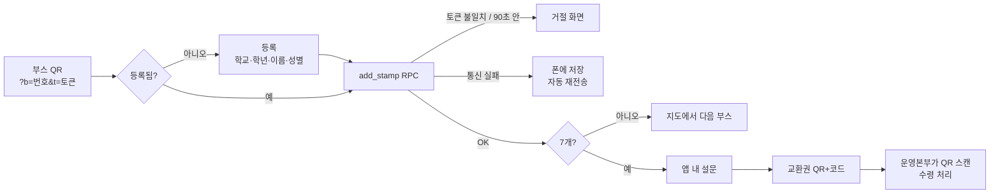

## 아키텍처

```
 방문객 폰 (index.html)                       운영본부 (index.html#/admin · dashboard.html)
   │ anon 키                                    │ anon 키 + 관리자 비번(RPC 인자)
   ▼                                            ▼
 ┌────────────────────── Supabase (Postgres + PostgREST) ──────────────────────┐
 │ 직접 읽기  booths · settings · booth_stats · hourly_stats   (개인정보 없음)      │
 │ 방문객 RPC visitor_create / visitor_get / visitor_stamps / visitor_recover       │
 │           add_stamp(토큰·90초 검사) / visitor_survey_submit(완주 확인)            │
 │ 관리자 RPC admin_ok(비번 해시) 뒤에서만 — 집계·명단·선물·부스·설정·대시보드         │
 │ RLS       visitors · stamps · survey_answers · booth_tokens 정책 없음 = RPC 로만   │
 └────────────────────────────────────────────────────────────────────────────┘
```

- **한 파일 구조** — CONFIG → UTIL → STORAGE → DATA LAYER(LocalDB / SupabaseDB, 같은 인터페이스) → 상태 → 지도 기하 → 라우터 → 화면 → 스캐너 → 관리자 → BOOT. `CONFIG.supabaseUrl` 을 비우면 브라우저 저장소만으로 동작(데모).
- **설정은 서버에** — 행사명·완주 개수·설문 문항·공지·일정을 관리자가 저장하면 열린 폰에도 5분 안에 반영.
- **대시보드는 요청 하나** — `admin_dashboard` RPC 가 집계 전부를 jsonb 로 (이름 없음). 15초 갱신에 요청 1개. 부스 줄을 누르면 그 부스 참여자 명단(`admin_booth_visitors`)만 따로.
- **무료 한도 안에서 4~5만 명** — jsQR·qrcode 는 CDN 우선(3초 타임아웃 → 같은 서버 파일 폴백, 1년 immutable), HTML 만 no-cache, favicon 인라인, 부스 목록은 배포 시 HTML 에 박은 시드의 버전이 서버 `settings.boothsVersion` 과 같으면 요청 생략. 첫 방문·재방문 모두 Vercel 1건(HTML) · Supabase 1~3건(각 1KB 안팎). 4만 명 기준 Vercel Edge Requests 약 40만/100만, Supabase egress 약 1.5GB/5GB.
- **지도는 코드로** — 이미지 없이 스타디움 기하(직선+반원)를 계산해 SVG 로. 부스 번호·구역만 바꾸면 자리가 따라옴.

## 기술 스택

| 영역 | 선택 | 이유 |
|---|---|---|
| 프런트 | Vanilla JS, 단일 HTML, 인라인 SVG | 빌드 없이 파일 하나. 담당자가 그대로 열어볼 수 있음 |
| QR | jsQR(카메라) · qrcode.js(교환권·인쇄) | jsdelivr CDN 우선, 3초 안에 안 오면 같은 서버 파일로 폴백 |
| DB / API | Supabase Postgres + PostgREST + plpgsql RPC | Auth 없이 anon 키 하나. 쓰기·개인정보는 전부 `security definer` RPC 뒤 |
| 호스팅 | Vercel 정적 | 파일 4개 업로드가 전부. `vercel.json` 에 캐시 헤더(js immutable / html no-cache) |
| 테스트 | Playwright(Chrome) e2e · Node 부하/지속 스크립트 | 실서버로 등록→도장→설문→교환권→관리자까지 |

## 보안·개인정보

- anon(publishable) 키는 공개용. `service_role` 키·DB 비밀번호는 코드 어디에도 없음.
- 방문객 데이터는 **uuid 를 아는 폰 = 본인**. 폰을 바꾸면 6자리 코드 + 이름으로 이어받기.
- 관리자 비밀번호는 pgcrypto 해시로 서버 저장, 8자 이상 강제. 로그인 실패 10회(10분) → 1분 잠금. 틀렸을 때 지연(`pg_sleep`)은 두지 않음 — 연결을 붙들어 DoS 통로가 됨.
- 치팅: QR 주소에 부스별 서버 토큰(`booth_tokens`, 읽기 불가) + 같은 사람 도장 간격 90초. 링크를 공유받아도 7개에 10분 넘게 걸림.
- 행사 후 관리자 › 데이터에서 개인정보 파기.

## 부하·지속 테스트 (Supabase 무료 플랜)

| | 폭주 테스트 | 지속 테스트 1차 | 지속 테스트 2차 |
|---|---|---|---|
| 모양 | N명이 3초 안에 동시 등록+도장 7개 | 초당 4명 도착 × 10분, 실제 RPC 흐름(토큰·90초 간격) + 대시보드 15초 폴링 | 초당 6명 도착 × 15분, 서로 다른 uuid + 유효 토큰, 대시보드 2대 폴링 |
| 결과 | 800명 동시까지 에러 0 · p95 < 1s, 2000명은 66% 타임아웃 | 방문객 2,344명 · 요청 11,558건 · **에러 0 · p50 53ms · p95 64ms**, 10분간 지연 상승 없음 | 방문객 5,242명 · 요청 35,314건 · **에러 0 · p95 73ms**. 초당 59건까지 평평, 65건에서 쓰기 p95 3~4초로 줄 섬(에러 없음) |

무료 컴퓨트의 한계는 대략 **초당 60건 쓰기**. 행사 실부하(하루 5만 명 = 초당 2~3명 등록, 부스 체류가 길어 도장은 초당 10~15건)보다 훨씬 높은 부하를 버텨 무료 플랜으로 충분하다고 판단. 위험은 개막 직후 순간 폭주뿐 — 그건 행사 며칠 전 Supabase Pro + 컴퓨트 Micro 로 올려두는 것으로 대비(컴퓨트 변경 시 약 2분 다운타임이라 당일 아침엔 하지 않음).

**요청 수·전송량 (재방문 1회, Chrome 실측)**: Vercel HTML 1건(js 는 디스크 캐시) · Supabase 설정 1건(등록자는 내 정보·내 도장 포함 3건) · 404 없음. 5만 명 × 리로드 10회 ≈ Vercel 65만 요청, Supabase 전송 수백 MB.

## 설치

1. **Supabase** 프로젝트 생성 → SQL Editor 에 `supabase_setup.sql` 통째로 붙여넣고 Run (다시 실행해도 됨).
2. `원주축전_스탬프앱_3.html` 의 `CONFIG.supabaseUrl` · `supabaseAnonKey` 채우기 (`운영대시보드.html` 도 같은 값).
3. 관리자 `#/admin` (초기 비번 `1234`) → 데이터 탭에서 비번 변경 → 부스 탭에서 저장(서버로 올라가며 QR 토큰 발급) → QR 시트 인쇄.
4. 배포: `배포.ps1` (deploy/ 갱신 → `?v=DEV` 를 배포 시각으로 치환 → 서버 부스 목록·버전을 `SEED_BOOTHS`/`seedVersion` 에 박음 → `vercel deploy --prod`). 부스를 고친 뒤 재배포하면 방문객 폰이 부스 목록을 서버에서 받지 않음. 배포 주소가 바뀌면 QR 재인쇄.

로컬에서 그냥 열어보려면 `CONFIG.supabaseUrl` 을 비우면 됨 — 브라우저 저장소로 동작하고 관리자 › 데이터에 데모 데이터 버튼이 생김. `CONFIG.testStampInput: true` 면 카메라 대신 부스 번호 입력창(https 없는 로컬용, 배포 스크립트가 false 로 바꿈).

## 개발자 정보

### 구조
```
원주축전_스탬프앱_3.html   앱 전체 (방문객 + 관리자). 스크립트 맨 위에 설계 개요·데이터 흐름 주석
운영대시보드.html          운영본부 대시보드 (admin_dashboard RPC)
supabase_setup.sql         테이블·뷰·RLS·RPC·Storage. 1~10절, 재실행 가능
jsQR.js · qrcode.min.js    로컬 라이브러리 (배포 시 같이)
배포.ps1 · deploy/         Vercel 배포 (vercel.json: cleanUrls, html no-cache · js immutable / 배포.ps1 이 ?v= 버전 치환)
기능정리.md                요구사항·결정 사항·변경 이력의 단일 출처
tests/                     playwright e2e (test_v3 · test_survey · test_live_survey), soak.mjs 지속 테스트, soakchart.mjs 결과 차트, shots_public.mjs README 스크린샷
assets/                    README 스크린샷 (전부 더미 데이터)
```

### 명령
| 명령 | 설명 |
|---|---|
| `cd tests && npm i playwright` | 테스트 준비 (Chrome 채널 사용) |
| `node tests/test_v3.mjs` | 실서버 e2e: 설문 타이머·복귀 링크·탭 동기화·행사 설정·대시보드 |
| `node tests/test_survey.mjs` | 로컬 모드 e2e: 앱 내 설문 제출·관리자 문항 편집·결과·CSV |
| `node tests/test_gift_scan.mjs` · `test_booth_visitors.mjs` | 로컬 모드 e2e: 교환권 QR 연속 스캔 · 부스별 참여자 명단(현황 시트·대시보드 카드) |
| `node tests/test_seed.mjs` | 부스 시드 버전 매칭 · CDN 우선 로드 · CDN 차단/무응답 폴백 |
| `node tests/test_lockout.mjs <비번>` | 실서버: 로그인 10회 실패 → 1분 잠금 → 해제 (지연 없음 확인) |
| `node tests/soak.mjs [분] [초당 도착] [접두어]` | 지속 테스트 → `지속테스트_날짜.json`, 이어서 `node tests/soakchart.mjs` 로 PNG. 테스트 데이터는 남김 |

### 설계 메모
- 화면 코드는 `DB.*` 만 부른다. LocalDB / SupabaseDB 가 같은 메서드를 구현하므로 저장소를 바꿔도 화면은 그대로.
- 서버 거절(BAD_TOKEN · TOO_FAST · NOT_DONE)은 통신 실패가 아니므로 오프라인 큐에 넣지 않고 안내 화면으로.
- 관리자 RPC 는 전부 `pw` 인자를 받아 `admin_ok(pw)` 로 시작. 비번이 바뀌면 다음 요청에서 자동 로그아웃.
- 설문은 세 가지 모드: 설문 링크 없음 → 앱 내 설문(기본) / 링크 있음 → 외부 폼 + 60초 뒤 자기신고 + `?survey` 복귀 링크 자동 완료 / 둘 다 없음 → 버튼만.
- DB 컬럼은 풀네임(`organization`, `sort_order`…), 앱 내부는 짧은 이름 — 변환은 `SupabaseDB._b()` 한 곳.
- 요구사항과 변경 이력은 `기능정리.md`.
