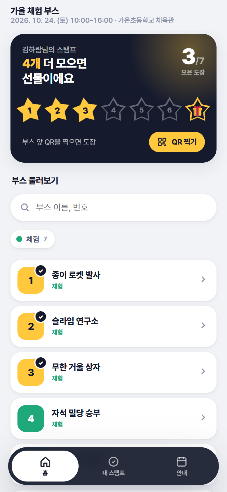
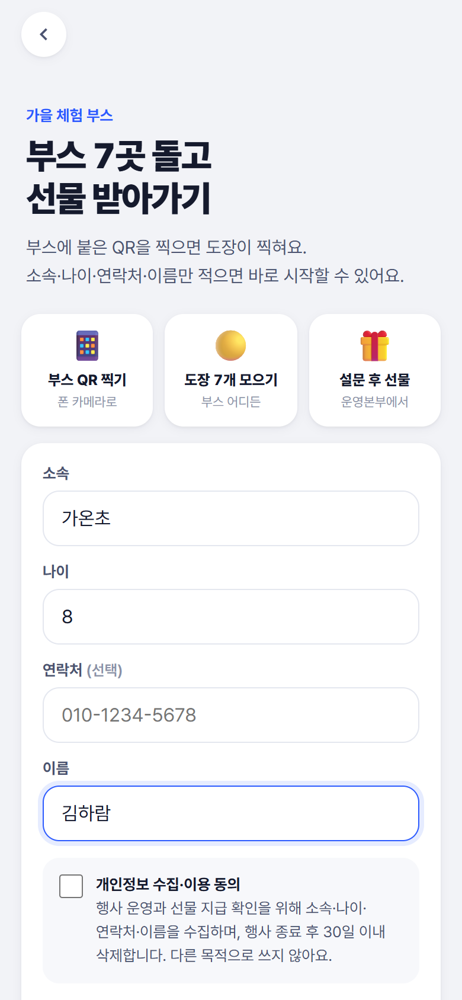
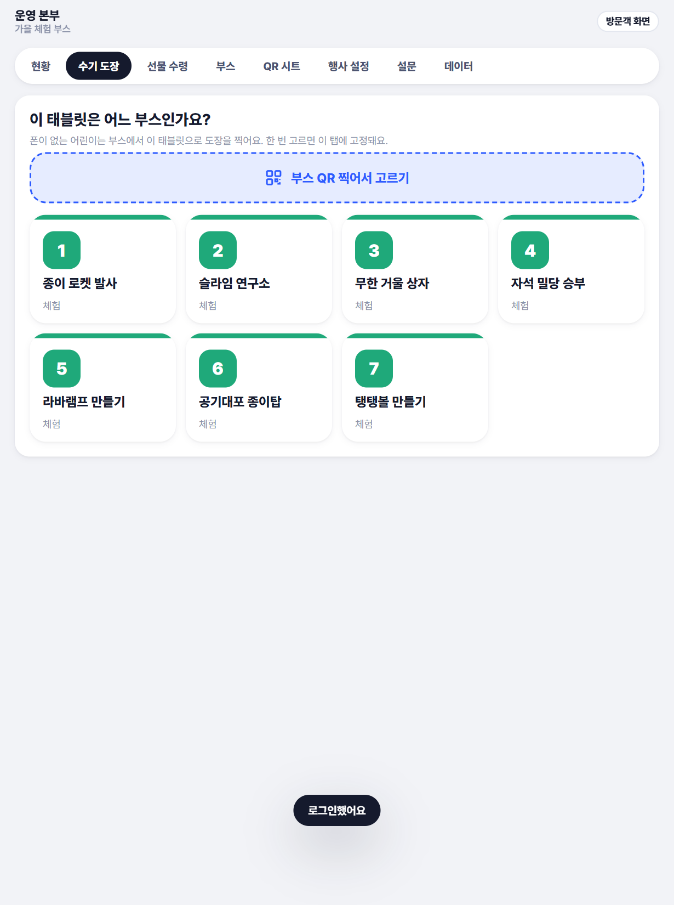
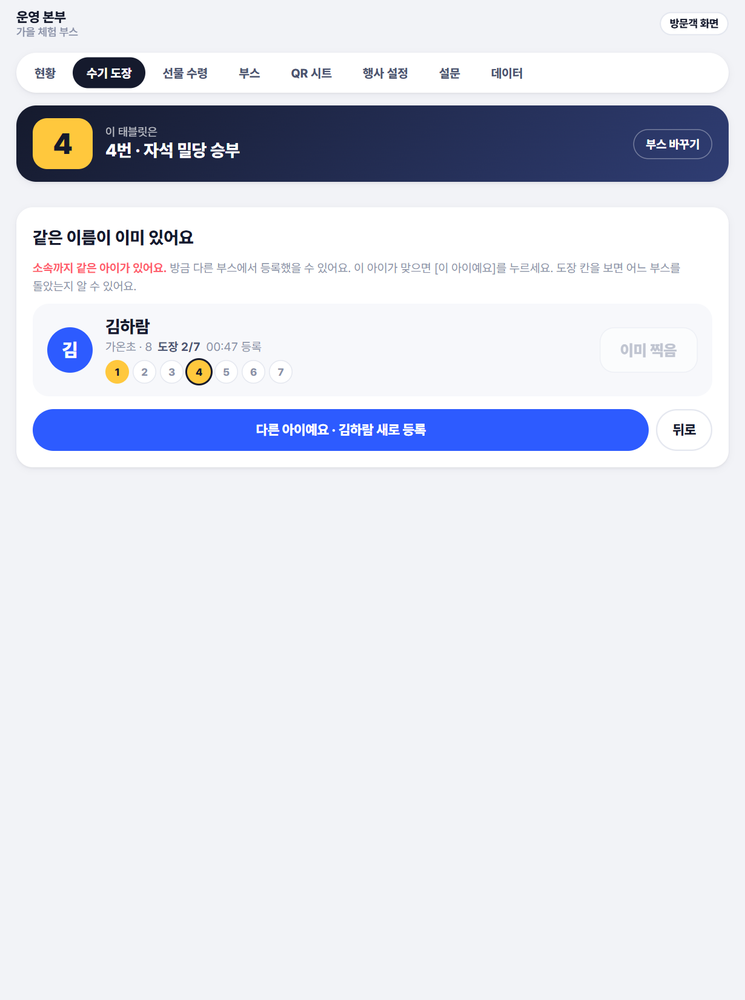

# booth-lite — 소규모 부스용 파생 버전 (축전 앱의 하위 프로젝트)

[2026 원주 수학과학축전 스탬프 랠리](../README.md)에서 파생한 **부스 7개 규모 행사용** 버전. 지도가 필요 없고, 폰이 없는 저학년 어린이가 많은 현장이라 **부스마다 둔 태블릿으로 직원이 도장을 찍는 운영**을 중심으로 설계했다. 코드베이스는 축전 앱과 공유하고, 서버(Supabase)와 호스팅(Vercel)은 별도 프로젝트로 분리해 두 행사의 데이터가 섞이지 않는다.

> 아래 이미지는 모두 **더미 데이터**다.

<table>
  <tr>
    <td align="center"><br><sub><b>방문객 홈</b><br>부스 7개 · 지도 없음</sub></td>
    <td align="center"><br><sub><b>등록</b><br>소속·나이·이름</sub></td>
    <td align="center" colspan="2"><br><sub><b>부스 태블릿</b><br>방금 다른 부스에서 도장 찍은 아이들 · 부스별 도장 칸</sub></td>
  </tr>
  <tr>
    <td align="center" colspan="2"><br><sub><b>부스 고르기</b><br>태블릿을 부스에 고정</sub></td>
    <td align="center"><br><sub><b>도장 확인</b><br>5초 뒤 자동 복귀</sub></td>
    <td align="center"><br><sub><b>같은 이름 확인</b><br>이중 등록 방지</sub></td>
  </tr>
</table>

## 축전 앱과 다른 점

| 영역 | 축전 앱 | booth-lite |
|---|---|---|
| 부스 | 95개, 배치도 지도·경로·히트맵 | 7개, 지도 없음(`CONFIG.miniMode`) — 지도 탭·배치도·대시보드 히트맵 비표시 |
| 등록 항목 | 학교·구분·학년·이름·성별 고정 | 소속·나이·연락처 + 이름. 관리자 › 행사 설정에서 항목별 사용/필수 선택(`settings.regFields`) |
| DB 열 | school·grade·gender | 같은 열을 그대로 쓰고 의미만 바꿈(school=소속, grade=나이, gender=연락처) → SQL 구조 변경 없음 |
| 집계 | 학년군(초저·초고·중·고·성인) | 나이대(어린이 ~12 · 청소년 13~18 · 성인 19~) |
| 수기 도장 | 선물 수령 탭 안의 보조 기능 | 부스 태블릿 모드(아래) |
| 설문 | 완주 → 설문 → 교환권 | 행사 설정의 설문 사용 여부 선택. 끄면 완주 즉시 교환권, 선물 수령도 설문 확인 생략 |
| 기본 데이터 | 축전 일정·리플릿·설문 문항 | 비움 / 일반 행사용 문항 |
| 서버 | 축전 Supabase | 별도 Supabase 프로젝트(무료 플랜), 같은 `supabase_setup.sql` 1~16절 |

## 부스 태블릿 (관리자 › 수기 도장)

1. 관리자로 로그인한 태블릿이 부스 QR을 한 번 찍으면 그 부스에 고정(`sessionStorage`). 부스 고르기 화면은 분류 색·번호 타일
2. 이름 두 글자 입력 → 카드 [도장] → 확인 화면(받은 부스 칸, 5초 뒤 자동 복귀) → 다음 어린이
3. 카드마다 1~7 부스 칸으로 어느 부스 도장을 받았는지 표시. 이 부스에 이미 있으면 [이미 찍음]으로 잠김(`visitor_stamps` RPC, 1분 캐시)
4. 검색어가 없을 땐 "방금 다른 부스에서 도장 찍은 아이들"(최근 10분, 이 부스 미도장)을 먼저 표시 → 대부분 이름 입력 없이 탭 한 번. 부스별 명단 RPC(`admin_booth_visitors`)를 부스마다 40줄씩 받아 합치므로 SQL 추가 없음, 20초 갱신
5. 처음 온 아이는 [처음 왔어요] → 등록 항목 입력 → 등록과 도장을 한 번에 처리. 등록 직전 같은 이름을 조회해 "이 아이예요(기존 아이에게 도장) / 다른 아이예요(새로 등록)"를 고르게 해 같은 아이의 이중 등록 방지. 소속까지 같으면 경고 표시
6. 같은 이름의 다른 아이는 소속·나이·부스 칸·등록 시각으로 구분

등록은 `visitor_create`(방문객 RPC, 관리자 폰의 `S.me`는 그대로), 도장은 `admin_add_stamp`(토큰·90초 간격 검사 없음).

## 축전 앱과 동기화 (`sync/`)

파생본은 축전 앱 원본에 텍스트 치환 스크립트를 순서대로 적용해 만든다. 축전 쪽 보안·버그 수정이 그대로 따라온다.

```
축전 앱 HTML → booth-lite_스탬프앱.html 로 복사
python -I sync/1_미니모드.py … python -I sync/11_동명이인_부스상황제거.py   (순서대로)
CONFIG 의 supabaseUrl · supabaseAnonKey 를 이 프로젝트 값으로
powershell -File 배포.ps1
```

| 단계 | 내용 |
|---|---|
| 1 미니모드 | 제목·CONFIG·부스 시드 7개·분류 1개, 지도 탭/버튼/라우트 제거, 관리자 탭 교체, 관리자가 부스 QR을 찍으면 수기 도장으로 |
| 2 수기도장 | 수기 도장 화면 뼈대 |
| 3 소속나이이름 | 등록 항목·표·CSV·대시보드 라벨, 나이대 집계 |
| 4 등록항목설정 | `regFields` 토글, 라우터 조각별 디코딩(축전이 이미 반영했으면 건너뜀), 기본 일정·자료 비움 |
| 5 수기도장_태블릿 | 부스 고정 흐름, 대시보드 히트맵 비표시 |
| 6 번호표_UI | 카드·확인 화면 UI, 자동 검색 |
| 7 설문설정 | `surveyOn` 토글, 기본 문항 |
| 8 부스고르기_타일 | 타일 격자 |
| 9 방금온아이들 | 최근 10분 목록, `DB.recentVisitors` |
| 10 부스별도장표시 | 1~7 부스 칸, [이미 찍음] |
| 11 동명이인_부스상황제거 | 같은 이름 확인 화면 |

스크립트는 원문 문자열 치환이라 축전 쪽 해당 줄이 바뀌면 `assert`에서 멈춘다 → 그 치환만 수정 후 재실행. 3·5단계는 대시보드가 이미 반영돼 있으면 건너뛴다.

## 설치

1. Supabase 새 프로젝트 → SQL Editor에서 `supabase_setup.sql` 전체 실행(1~16절)
2. `booth-lite_스탬프앱.html`과 `운영대시보드.html`의 `supabaseUrl` · `supabaseAnonKey` 입력
3. `배포.ps1` 실행(Vercel 로그인 필요). 서버에 부스가 없으면 관리자 › 부스에서 한 번 저장 → 토큰 발급
4. 관리자 `#/admin`(초기 비밀번호 1234 → 데이터 탭에서 변경), 행사 설정에서 행사명·날짜·등록 항목·설문 사용 여부

## 검증

- 로컬(Playwright, `supabaseUrl`을 비운 복사본): 태블릿 흐름 32체크, 등록 항목·설문 설정 18체크, 콘솔 에러 0
- 실서버 e2e 16체크: QR 등록 → 도장, 90초 간격 거절, 관리자 QR → 태블릿 고정, 최근 목록·부스 칸·검색·등록, 대시보드. 종료 시 `admin_reset`으로 정리(실데이터 없는 상태에서만)

## 설계 메모

- 폰 없는 어린이 식별은 번호표 카드(QR 인쇄·카드 번호 연결) 방식과 이름 검색 방식을 비교 → 인쇄·배부·번호 연결 없이 운영되는 이름 검색 + 최근 목록 + 부스 칸 조합 채택
- 수기 도장 화면은 "부스 고정 → 찾기 → 확인 → 다음"의 단일 흐름으로 구성 → 직원이 한 손으로 반복 처리
- 부스별 혼잡도 표시는 태블릿 화면에서 제외 → 집계는 운영 대시보드에서
