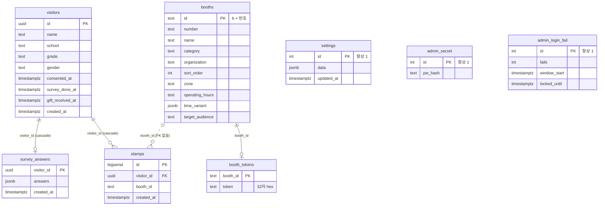

# 설계 문서

행사용 부스 QR 스탬프 앱의 데이터 모델, 핵심 흐름, 동시성 처리, 설계 결정, 보안 모델, 검증 방법, 배포·운영을 정리한다. 기능 목록과 화면은 [README](../README.md)에 있으므로 여기서는 "왜 이렇게 만들었나"와 "어디까지 보장하고 어디부터 보장하지 않나"에 집중한다.

코드 규모: 앱 `원주축전_스탬프앱_3.html` 2,721줄(방문객 + 관리자, 단일 파일), `supabase_setup.sql` 17절(함수 정의 39건, 고유 함수 29개), Playwright/Node 테스트 12벌.

## 1. 문제와 제약

- 부스 95개, 하루 최대 5만 명 규모의 야외 행사에서 방문객이 부스를 돌며 도장을 모으고, 7개를 채우면 설문 뒤 선물 교환권을 받는다.
- 부스에는 도장을 찍어 줄 인력이 없다. 부스마다 인쇄한 QR 한 장을 붙여 두고 방문객이 자기 폰으로 찍는 방식만 가능하다.
- 예산이 없고 운영 담당자는 개발자가 아니다. 서버 코드 없이 Supabase 무료 플랜 + Vercel 정적 호스팅으로 운영하며, 부스·설정·설문 문항은 관리자 화면에서 바꾼다.
- 방문객 대다수가 미성년자이므로 수집 항목을 최소화하고, 익명 키로는 명단을 읽을 수 없어야 한다.
- 운동장 통신이 불안정하고 개막 직후 폭주가 예상되므로 도장 요청은 실패해도 잃지 않아야 하며, 링크 공유만으로 완주하는 치팅을 억제해야 한다.

## 2. 데이터 모델

### 테이블

| 테이블 | 키 | 주요 컬럼 | 제약·인덱스 |
|---|---|---|---|
| `booths` | `id text` PK (`'b' + 번호`) | `number`, `name`, `category`, `organization`, `description`, `sort_order int`, `zone`, `video_url`, `pdf_url`, `image_url`, `operating_hours`, `time_variant jsonb`, `target_audience` | RLS 켜고 anon `select` 정책만. 관리자 저장은 전체 삭제 후 재삽입 |
| `booth_tokens` | `booth_id text` PK | `token text not null` (`gen_random_bytes(16)` hex = 32자) | RLS 켜고 정책 없음(API 로 읽기 불가). 부스 저장 때 없는 부스만 발급, 기존 토큰 유지 |
| `visitors` | `id uuid` PK (`gen_random_uuid()`) | `name text not null`, `school`, `grade`, `gender`, `consented_at timestamptz not null`, `survey_done_at`, `gift_received_at`, `created_at` | RLS 켜고 정책 없음. 이름 20자·학교 30자 절단은 `visitor_create` 에서 |
| `stamps` | `id bigserial` PK | `visitor_id uuid` FK → `visitors` (`on delete cascade`), `booth_id text`, `created_at` | `unique (visitor_id, booth_id)`. 인덱스 `visitor_id`, `booth_id`, `created_at`. `booth_id` 는 FK 가 아님(아래 결정 표 참고) |
| `survey_answers` | `visitor_id uuid` PK, FK → `visitors` (cascade) | `answers jsonb not null`, `created_at` | RLS 켜고 정책 없음. 방문객당 1행, 이름 없음 |
| `settings` | `id int` PK, `check (id = 1)` | `data jsonb not null default '{}'`, `updated_at` | 단일 행. anon `select` 정책만, 쓰기는 `admin_save_settings` 의 키 병합 |
| `admin_secret` | `id int` PK, `check (id = 1)` | `pw_hash text not null` (pgcrypto `crypt`, Blowfish) | 단일 행. RLS 켜고 정책 없음 |
| `admin_login_fail` | `id int` PK, `check (id = 1)` | `fails int`, `window_start`, `locked_until`, `last_fail_at`, `total_fails bigint`, `total_locks int` | 단일 행(전역 잠금 상태). RLS 켜고 정책 없음 |

집계 뷰 `booth_stats`(부스별 건수·마지막 시각)와 `hourly_stats`(시간대별 건수)는 개인정보가 없어 anon 이 읽는다. `visitor_stats`(방문객별 도장 수)는 anon 권한을 `revoke` 하고 관리자 RPC 안에서만 쓴다.

### 접근 등급

| 등급 | 인증 | 대상 |
|---|---|---|
| anon 직접 읽기 | anon 키만 | `booths`, `settings`, `booth_stats`, `hourly_stats` |
| 방문객 RPC | anon 키 + 방문객 uuid(추측 불가) | `visitor_create`, `visitor_get`, `visitor_stamps`, `visitor_recover`, `add_stamp`, `visitor_survey_done`, `visitor_survey_submit` |
| 관리자 RPC | anon 키 + 비밀번호 인자(`admin_ok(pw)`) | `admin_login`, `admin_set_password`, `admin_reset`, `admin_set_gift`, `admin_save_booths`, `admin_booth_tokens`, `admin_save_settings`, `admin_counts`, `admin_visitor_stats`, `admin_visitors`, `admin_stamps`, `admin_find_visitor`, `admin_add_stamp`, `admin_survey_answers`, `admin_dashboard`, `admin_booth_visitors` |
| 내부 전용 | anon `revoke` | `admin_ok`, `ensure_booth_tokens`, `survey_scale_summary`, `admin_locked_secs`, `admin_note_fail` |

모든 RPC 는 `security definer` 이고 `search_path = public, extensions` 를 고정한다. 개인정보 테이블에 RLS 정책을 하나도 두지 않았으므로 PostgREST 의 테이블 엔드포인트로는 아무 행도 읽거나 쓸 수 없고, 데이터가 나가는 경로는 RPC 본문뿐이다.

### 클라이언트 저장소

앱은 서버 외에 폰 저장소를 쓴다. `store` 는 `window.storage` → `localStorage` → 메모리 순으로 폴백한다.

| 키 | 저장소 | 내용 |
|---|---|---|
| `wj:me` | localStorage | 내 방문객 uuid. 이 값이 있는 폰이 본인이다 |
| `wj:me_cache`, `wj:stamps_cache` | localStorage | 내 정보·내 도장의 마지막 사본. 오프라인 부팅 때 복구용 |
| `wj:pending` | localStorage | 서버에 못 보낸 도장 `{boothId, token, at}` 목록 |
| `wj:booths_cache` | localStorage | 부스 목록 `{v, list}`. `settings.boothsVersion` 과 같으면 서버 요청 생략 |
| `wj:survey_open` | localStorage | 외부 설문 모드에서 설문 링크를 누른 시각(60초 타이머) |
| `wj:adm` | sessionStorage | 로그인에 통과한 관리자 비밀번호. 탭을 닫으면 사라진다 |
| `wj:tok` | sessionStorage | QR 에서 받은 부스 번호 → 토큰. 등록 화면을 거쳐도 유지 |
| `wj:booths`, `wj:settings`, `wj:data` | localStorage / IndexedDB | 로컬 모드(Supabase 주소 비움) 전용 |

### ER 다이어그램

## 3. 핵심 흐름

1. **등록** — `visitor_create(name, school, grade, gender)` 가 `visitors` 행을 만들고 전체 행을 돌려준다. 앱은 uuid 를 폰 저장소(`wj:me`)에 두고 이후 모든 방문객 요청에 이 uuid 를 보낸다. 폰이 바뀌면 `visitor_recover(6자리 코드, 이름)` 로 같은 uuid 를 새 폰에 저장한다. 6자리 코드는 uuid 끝 6자리다.
2. **도장** — QR 주소 `?b=번호&t=토큰` 으로 진입하면 토큰을 `sessionStorage` 에 두고 `add_stamp(vid, bid, tok)` 를 호출한다. 서버는 다음 순서로 검사한다.
   1. `select … from visitors where id = vid for update` 로 방문객 행을 잠근다(같은 방문객의 동시 요청 직렬화).
   2. 같은 부스 도장이 이미 있으면 `{dup: true}` 를 돌려준다.
   3. `booth_tokens` 에 (부스, 토큰) 쌍이 없으면 `BAD_TOKEN` 예외.
   4. 마지막 도장 뒤 `stamp_gap_sec()` = 90초가 지나지 않았으면 `TOO_FAST:남은초` 예외.
   5. `insert … on conflict do nothing returning` — `unique(visitor_id, booth_id)` 에 걸려 행이 안 돌아오면 `{dup: true}`, 들어가면 `{ok: true, stamp}`.
3. **완주** — 앱이 `내 도장 수 ≥ settings.stampGoal`(기본 7) 이면 설문 버튼을 연다. 완주 판정의 최종 근거는 서버다(다음 단계).
4. **설문** — `visitor_survey_submit(vid, answers)` 가 방문객 존재, 도장 수 ≥ `stampGoal`, 응답 크기 8,000바이트 이하를 검사한 뒤 `survey_answers` 에 넣고 `visitors.survey_done_at` 을 `coalesce(survey_done_at, now())` 로 찍는다. 두 번 제출해도 첫 응답과 첫 시각이 유지된다. 설문 링크를 외부 폼으로 두는 모드에서는 `visitor_survey_done(vid)` 로 시각만 1회 기록한다(자기 신고).
5. **교환권** — `survey_done_at` 이 있으면 앱이 `WJ:<uuid>` 텍스트의 QR 과 6자리 코드를 그린다.
6. **수령** — 관리자 폰이 교환권 QR 을 연속 스캔하거나 코드로 찾아 `admin_set_gift(pw, vid, true)` 를 부른다. 서버는 `gift_received_at is null` 인 행만 갱신하고 `found` 를 boolean 으로 돌려주므로, 두 관리자가 같은 교환권을 동시에 처리해도 한 쪽은 `false`("이미 받음")를 받는다. 앱은 처리 직전 `visitor_get` 으로 한 번 더 확인한다.

### RPC 오류 코드

서버 거절은 plpgsql `raise exception` 의 메시지로 구분한다. PostgREST 는 이를 HTTP 400 과 `message` 로 돌려주고, 앱은 메시지 접두어로 분기한다.

| 코드 | 함수 | 뜻 | 앱 처리 |
|---|---|---|---|
| `BAD_TOKEN` | `add_stamp` | (부스, 토큰) 쌍이 `booth_tokens` 에 없음 | "확인 불가" 화면. 큐에 넣지 않음 |
| `TOO_FAST:<초>` | `add_stamp` | 마지막 도장 뒤 90초 미경과 | "N초 후에" 화면. 큐에 있던 건이면 다음 주기에 재시도 |
| `NO_VISITOR`, `NOT_DONE`, `TOO_LONG` | `visitor_survey_submit` | 방문객 없음 / 완주 전 / 응답 8,000바이트 초과 | 안내 토스트 |
| `ADMIN_UNAUTHORIZED` | 모든 관리자 RPC | 비밀번호 불일치 | 자동 로그아웃 |
| `ADMIN_LOCKED:<초>` | 모든 관리자 RPC | 틀린 비밀번호이고 잠금 중 | 남은 초 표시. 대시보드는 다음 갱신에 재시도 |
| `PASSWORD_TOO_SHORT` | `admin_set_password` | 새 비밀번호 8자 미만 | 안내 토스트 |
| `BAD_SETTINGS` | `admin_save_settings` | jsonb 객체가 아님 | "저장 실패" 토스트 |

`{dup: true}` 와 `admin_set_gift` 의 `false` 는 예외가 아니라 정상 반환이다. 이미 그 상태라는 뜻이므로 재시도 대상이 아니다.

### 오프라인 큐와 dup 재동기화

- 통신 실패와 8초 타임아웃(`CONFIG.requestTimeoutMs`)만 큐(`wj:pending`)에 넣는다. 서버 거절(`BAD_TOKEN`, `TOO_FAST`, `NOT_DONE`)은 통신 실패가 아니므로 큐에 넣지 않고 안내 화면을 보여 준다.
- `flushPending()` 은 부팅 때, `online` 이벤트 때, 30초마다 큐를 하나씩 다시 보낸다. 응답이 `ok` 면 내 도장에 추가, `dup` 이면 "타임아웃은 났지만 서버에는 들어간 경우"로 보고 `visitor_stamps` 로 서버 목록을 통째로 다시 받아 로컬을 맞춘다. `tooFast` 는 큐에 남겨 다음 주기에, `badToken` 은 버린다.
- 큐에 든 도장은 화면에 "전송 대기"로 표시하고 완주 판정에서는 전송이 끝날 때까지 제외한다.

## 4. 동시성·멱등성

| 지점 | 처리 | 검증 |
|---|---|---|
| 같은 방문객의 동시 도장 요청 | `add_stamp` 첫 줄에서 방문객 행을 `for update` 로 잠근다. 잠금이 없으면 부스 7개 링크를 동시에 열었을 때 7개 요청이 모두 "마지막 도장 없음"을 읽어 90초 간격이 무력화된다. 잠근 뒤에는 앞 요청이 커밋된 뒤 뒤 요청이 마지막 시각을 다시 읽어 `TOO_FAST` 로 거절된다. 다른 방문객끼리는 서로 다른 행이라 영향이 없다 | `tests/test_stamp_race.mjs` — 실서버에 같은 uuid 로 7건을 `Promise.all` 로 보내 성공 1건, `TOO_FAST` 6건, 서버 도장 1개를 확인한다. 잠금을 빼면 7건이 전부 들어가 이 테스트가 실패한다 |
| 같은 부스 중복 도장 | `unique(visitor_id, booth_id)` + `on conflict do nothing` 으로 DB 가 최종 판정한다. 사전 `exists` 검사는 빠른 경로일 뿐이다 | 같은 테스트에서 성공한 부스에 재요청 → `dup` |
| 설정 저장(관리자 둘·탭 둘) | 서버 `admin_save_settings` 가 `settings.data \|\| excluded.data` 로 키 단위 병합을 하고, 앱 `savePatch()` 도 저장 직전 서버 값을 읽어 바꿀 키만 얹는다. 둘 중 하나만 있어도 다른 키를 지우지 않으며, 같은 키를 동시에 바꾸면 나중 쓰기가 이긴다 | 실서버 e2e 에서 설정 저장 → 방문객 반영 확인. 동시 저장 자체를 재현하는 테스트는 없다 |
| 교환권 1회 | `admin_set_gift` 가 미수령 행만 갱신하고 결과를 boolean 으로 돌려준다. 한 트랜잭션의 조건부 `update` 이므로 별도 잠금이 필요 없다 | 로컬 모드 e2e(`test_gift_scan.mjs`)에서 연속 스캔·이미 수령 안내 확인 |
| 설문 제출 | `survey_answers` PK + `on conflict do nothing`, `survey_done_at` 은 `coalesce` 로 첫 값 유지 | 실서버 e2e(`test_live_survey.mjs`) |
| 등록 | **멱등이 아니다.** `visitor_create` 는 부를 때마다 새 행을 만든다. 타임아웃 뒤 재시도하면 방문객 행이 둘 생길 수 있다(앱은 성공 응답을 받은 uuid 만 저장하므로 "고아 행"이 남는 형태). 이름·학교가 유일 키가 아니고 요청 식별자도 없어 서버가 중복을 구분할 근거가 없다 | 알려진 한계. 행사 규모에서 고아 행은 집계 오차로만 나타난다고 추정한다 |

## 5. 설계 결정

| 영역 | 결정 | 이유 | 기각한 대안 |
|---|---|---|---|
| 운영 방식 | QR 은 부스에 고정 인쇄하고 방문객이 자기 폰으로 찍는다 | 부스에 도장을 찍어 줄 인력이 없다 | 부스 직원이 방문객 폰을 찍는 방식, 종이 스탬프 |
| 아키텍처 | 단일 HTML + Supabase(PostgREST·plpgsql RPC) + Vercel 정적 호스팅, 서버 코드 없음 | 예산 0, 비개발자 담당자, 배포 단위가 파일 하나 | React·빌드 도구, 별도 백엔드 |
| 인증 | 로그인·Auth 없이 anon 키 하나. 방문객은 "uuid 를 아는 폰 = 본인" | 수천 명에게 가입을 요구할 수 없고, 익명 로그인은 MAU 가 폭증한다 | Supabase Auth 익명 로그인 |
| 데이터 접근 | 개인정보 테이블에 RLS 정책을 두지 않고 `security definer` RPC 로만 읽고 쓴다 | 초기에는 select 정책이 있어 anon 키로 명단이 읽혔다. 정책을 전부 제거하고 뷰 권한도 회수했다 | 행 단위 RLS 정책으로 자기 행만 허용(uuid 를 JWT 에 실을 수 없어 성립하지 않음) |
| 수집 항목 | 학교·구분·학년·이름·성별만. 연락처 없음 | 미성년자 개인정보 최소 수집. 운영에 필요한 건 선물 수령 확인용 식별뿐 | 전화번호로 본인 확인 |
| 폰 교체 | 6자리 코드(uuid 끝 6자리) + 이름으로 기록 이어받기 | 카카오톡 인앱 브라우저와 사파리가 저장소를 공유하지 않고, 폰을 바꾸는 경우도 있다 | 전화번호·계정 연동 |
| 치팅 억제 | 부스별 32자 서버 토큰 + 같은 방문객 도장 간격 90초, 둘 다 서버가 검사 | 주소창에 번호만 쳐도 찍히던 문제. 토큰으로 위조를 막고, 간격으로 링크 공유의 이득(7개에 10분 이상)을 없앤다 | 토큰을 주기적으로 교체(인쇄 QR 이라 불가), 위치 확인(권한·정확도 문제) |
| 관리자 모델 | 비밀번호 하나를 bcrypt 해시로 저장하고 모든 관리자 RPC 에 인자로 동봉 | Auth 없이 관리자 여럿이 각자 폰에서 동시에 쓸 수 있어야 한다. 진입은 `#/admin` 직접 입력 | 관리자 계정·세션 토큰(서버 코드 필요) |
| 로그인 실패 처리 | 틀리면 지연 없이 즉시 거절. 10분 안 10회 실패 → 1분 잠금. 잠금은 틀린 비밀번호에만 걸린다 | `pg_sleep` 지연은 연결을 붙들어 연결 풀(무료 60개)을 먼저 고갈시키는 DoS 통로였다. 전역 잠금이 맞는 비밀번호까지 막으면 외부인이 운영본부 기능을 멈출 수 있어 순서를 "해시 비교 먼저"로 바꿨다 | 틀릴 때 0.5초 지연, 맞는 비밀번호도 막는 전역 잠금 |
| 실패 통신 | 통신 실패·8초 타임아웃은 오프라인 큐, 서버 거절은 안내 화면 | 운동장 통신이 불안정하다. 거절을 큐에 넣으면 영원히 재시도한다 | 모든 실패를 큐에 넣기 |
| 도장 ↔ 부스 관계 | `stamps.booth_id` 에 FK 를 두지 않는다 | 부스 저장이 전체 삭제 후 재삽입이라 FK 가 있으면 저장 때마다 도장이 지워지거나 저장이 막힌다. 부스 id 는 번호에서 결정되므로 재삽입 뒤에도 같은 값이다 | FK + cascade(도장 유실), upsert 로 부스 저장(삭제된 부스 처리가 복잡) |
| 설정 저장소 | 행사명·완주 개수·공지·설문 문항·분류 색·시설 위치를 `settings` jsonb 한 행에 두고 키 단위로 병합 저장 | 당일 변경(우천, 완주 개수)을 열린 폰에 반영해야 한다. 키마다 열을 두면 항목이 늘 때마다 SQL 을 바꿔야 한다 | 설정별 테이블·열, 통째 교체 저장(동시 저장 때 서로 지움) |
| 설문 | 앱 안에서 설문(문항은 관리자가 편집). 제출은 서버가 완주를 확인한 뒤 받는다 | 외부 폼은 완주 여부를 확인할 수 없어 자기 신고에 의존한다. 응답은 uuid 로만 저장해 이름과 분리한다 | 외부 폼 링크 + 자기 신고(모드로는 남겨 둠) |
| 대시보드 | 별도 페이지가 15초마다 `admin_dashboard` RPC 하나를 부른다. 집계만 돌려주고 이름은 나가지 않는다 | TV 에 띄우는 용도라 요청 수를 줄여야 하고, 화면이 개인정보를 들고 있을 이유가 없다 | 뷰·테이블을 여러 번 읽기 |
| 수령 처리 | 관리자 폰으로 교환권 QR 을 연속 스캔. QR 은 `WJ:uuid` 텍스트 | 줄이 서면 타이핑이 느리다. 서버가 미수령일 때만 처리하므로 여러 관리자가 동시에 처리해도 한 번만 | 코드 수기 입력만 |
| 부스 편집 | 엑셀(xlsx) 양식 내려받기·불러오기, 분류는 글자 입력(없는 이름은 새 분류), 구역만 드롭다운 | CSV 는 담당자가 보기 어렵다 | CSV, 붙여넣기(만들었다가 제거) |
| 컬럼 이름 | DB 컬럼은 풀네임(`organization`, `sort_order`), 앱 내부는 짧은 이름. 변환은 `SupabaseDB._b()` 한 곳 | 담당자가 Supabase 표를 직접 볼 수 있어야 한다 | 앱과 DB 이름 통일 |
| 전송량 | JS 는 CDN 우선(3초 타임아웃 → 같은 서버 파일), 1년 immutable + `?v=배포시각`, HTML 만 no-cache. 부스 목록은 배포 때 HTML 에 박고 버전이 같으면 요청 생략 | Vercel Edge Requests 100만/30일, Supabase egress 5GB/30일. 부스 목록(원본 30KB)이 1인 전송량의 절반이었다 | 매 로드마다 부스 목록 요청 |
| 요금제 | 무료 플랜으로 운영하고 Pro 는 개막 폭주 대비 선택지로 둔다 | 지속 테스트 2차(초당 6명 도착 × 15분, 요청 35,314건, 에러 0, p95 73ms)가 실제 행사 추정 부하(도장 초당 10~15건)보다 높았다 | 처음부터 Pro |
| 부하 한계 해석 | 무료 컴퓨트의 한계를 "초당 약 60건 쓰기"로 잡는다 | 초당 59건까지 p95 가 평평했고 65건에서 쓰기 p95 가 3~4초로 늘었다(에러 없음, 큐잉 형태). 전체 p99 2.3s 는 마지막 1분이 만든 값이다 | — |

## 6. 보안 모델과 알려진 한계

### anon 키의 범위

- HTML 에 든 키는 publishable(anon) 키뿐이다. `service_role` 키와 DB 비밀번호는 코드 어디에도 없다.
- 이 키로 할 수 있는 것: `booths`·`settings`·집계 뷰 2개 읽기, 방문객 RPC 호출, 관리자 RPC 호출(비밀번호를 알 때만 통과), Storage 버킷 `booth-files` 읽기·업로드.
- 할 수 없는 것: `visitors`·`stamps`·`survey_answers`·`booth_tokens`·`admin_secret`·`admin_login_fail` 의 테이블 엔드포인트 접근(정책 없음 → 빈 결과 또는 거절), `visitor_stats` 뷰(권한 회수), 내부 전용 함수 호출.

### RPC 입력 검증

- `visitor_create` 는 이름 20자·학교 30자로 자르고 나머지는 `coalesce` 로 빈 문자열을 넣는다.
- `visitor_survey_submit` 은 방문객 존재·완주·8,000바이트 상한을 검사한다. 응답 내용(문항 id·값 형식)은 검증하지 않는다.
- `admin_save_settings` 는 jsonb 객체가 아니면 거절한다. `admin_save_booths` 는 `jsonb_to_recordset` 의 열 정의로 타입을 강제한다.
- 부스 번호는 앱에서 `^[0-9A-Za-z가-힣]{1,6}$` 로 제한한다. 서버는 부스 번호 형식을 검사하지 않는다.

### 관리자 비밀번호 모델

- 비밀번호 하나를 pgcrypto `crypt(pw, gen_salt('bf'))`(bcrypt) 로 해시해 `admin_secret` 한 행에 둔다. 변경 시 8자 이상을 강제한다.
- 로그인에 통과한 비밀번호는 `sessionStorage` 에 평문으로 두고 모든 관리자 RPC 에 인자로 보낸다. HTTPS 안에서는 안전하지만 탭이 열린 동안 평문이 브라우저에 남고 매 요청에 실린다. 다른 곳에서 비밀번호가 바뀌면 다음 요청이 거절되어 자동 로그아웃된다.
- 잠금(10분 안 10회 실패 → 1분)은 `admin_login` 의 실패에만 걸리고 맞는 비밀번호는 잠금 중에도 통과한다. 잠금의 목적은 운영 마비 방지(외부인이 틀린 비밀번호로 운영본부 기능을 멈추지 못하게)이지 무차별 대입 차단이 아니다. 무차별 대입 방어는 bcrypt 비용 + 비밀번호 길이에 의존한다.
- 다른 관리자 RPC 에 틀린 비밀번호를 넣으면 즉시 거절되지만 횟수는 세지 않는다. 예외로 끝나는 함수 안의 `update` 는 롤백되기 때문이다.
- 틀렸을 때 지연(`pg_sleep`)은 두지 않는다. 지연은 DB 연결을 붙들어 연결 풀(무료 60개)을 먼저 고갈시키는 DoS 통로였다.
- 잠금 상태가 한 행(전역)이라 외부인이 틀린 로그인을 반복하면 다른 관리자의 **로그인**이 1분씩 막힐 수 있다. 이미 로그인한 관리자는 영향이 없다. 하루 행사 특성상 그대로 둔다.

### 토큰과 간격

- 부스 토큰은 128비트(32자 hex)이고 `booth_tokens` 는 API 로 읽을 수 없다. 관리자만 `admin_booth_tokens` 로 받아 QR 시트에 넣는다.
- 토큰은 한 번 발급되면 바뀌지 않는다(인쇄 QR 유지). 링크가 유출되면 회수할 수 없고, 90초 간격이 그 이득을 줄이는 유일한 장치다.
- 관리자 수동 도장(`admin_add_stamp`)은 토큰·간격 검사를 하지 않는다.

### 교환권 QR 이 방문객 식별자를 그대로 담는다(한계)

- 교환권 QR 텍스트 `WJ:<uuid>` 의 uuid 는 방문객의 유일한 인증 수단이다. 교환권 화면을 촬영한 사람은 `visitor_get` 으로 그 방문객의 이름·학교를 읽고 `visitor_stamps` 로 도장 목록을 볼 수 있다.
- 교환권은 완주 뒤 운영본부에서만 보여 주는 화면이라 노출 범위가 좁다고 보고 그대로 두었다. 별도 수령 토큰을 발급하면 막을 수 있다.

### Storage 업로드 정책

- 버킷 `booth-files` 는 public 이고 anon 에게 `insert` 를 허용한다. 관리자 화면도 anon 키로 올리기 때문이다. 20MB 상한, 덮어쓰기·삭제 정책은 없다.
- 따라서 anon 키를 가진 누구나 파일을 올릴 수 있다. 행사 후 정책을 회수할 항목으로 남겨 두었다.

### 미성년자 개인정보

- 수집 항목은 학교·구분·학년·이름·성별이다. 등록 화면에 "행사 운영과 선물 지급 확인을 위해 수집하며 행사 종료 후 30일 이내 삭제"를 명시하고 동의 체크를 받는다.
- 설문 응답은 uuid 로만 저장해 이름과 분리한다. 대시보드 RPC 는 집계만 돌려주고 이름을 내보내지 않는다.
- 관리자 › 데이터에 CSV 내보내기와 개인정보 파기(방문객·도장 전체 삭제, cascade 로 설문 응답도 삭제) 버튼이 있다.
- 앱은 법정대리인 동의를 받는 기능이 없다. 그 절차(안내문·현장 동의)는 주최 측 운영 절차에 의존한다.

### 관측·백업 없음

- 무료 플랜이라 자동 백업과 로그 보존이 없다. 서버 오류율·지연은 대시보드의 응답 시간과 테스트 스크립트로만 본다.
- 행사 후 CSV 를 내보낸 뒤 파기하는 것이 유일한 보존 경로다.
- 7일 미사용 시 프로젝트가 정지되므로 행사 전 사흘 안에 앱을 한 번 열어야 한다.

## 7. 검증

| 종류 | 파일 | 환경 | 확인하는 것 |
|---|---|---|---|
| 로컬 모드 e2e | `test_survey`, `test_gift_scan`, `test_booth_visitors`, `test_qr_first`, `test_reorder`, `test_media_sheet`, `test_admin_sort_chart` | Playwright(Chrome), `CONFIG.supabaseUrl` 비움 → LocalDB | 앱 내 설문 제출·문항 편집·CSV, 교환권 연속 스캔, 부스별 참여자 명단, QR 먼저 찍은 미등록 방문객의 등록 후 복귀, 부스 순서 편집, 자료 시트, 표 정렬·차트 |
| 실서버 e2e | `test_v3`, `test_live_survey`, `test_seed` | Playwright + Supabase | 설문 타이머·복귀 링크·탭 동기화·행사 설정·대시보드, 설문 제출 RPC, 시드 버전 매칭과 CDN 폴백(읽기만) |
| 경합 | `test_stamp_race` | Node fetch, 실서버 | 같은 uuid 동시 7건 → 성공 1·`TOO_FAST` 6, 재요청 `dup` |
| 잠금 | `test_lockout` | Node fetch, 실서버 | 틀린 비밀번호 10회 → 잠금, 잠금 중 맞는 비밀번호 통과, 해제. 거절 응답 400ms 미만(지연 없음) |
| 지속 부하 | `soak.mjs` (+ `soakchart.mjs`) | Node fetch, 실서버 | 초당 r명 도착 × N분, 실제 RPC 흐름(토큰·90초 간격·재진입 15%) + 대시보드 폴링. 1차 11,558건/p95 64ms, 2차 35,314건/p95 73ms/p99 2.3s, 에러 0 |
| 폭주 부하 | `load.mjs` | Node fetch, 실서버(구 스키마) | N명이 3초 안에 동시 등록 + 도장 7개. 800명 에러 0, 2,000명 66% 타임아웃. REST 직접 insert 가 열려 있던 시점의 기록이라 현재 스키마에서는 그대로 돌지 않는다 |

**보지 못하는 것.**

- 로컬 모드 e2e 는 `LocalDB` 가 같은 인터페이스를 흉내 낼 뿐이라 RPC·RLS·행 잠금·`on conflict` 를 타지 않는다. 화면 흐름은 검증하지만 서버 규칙은 검증하지 않는다.
- 부하는 클라이언트 1대에서 만든다. 폭주 테스트 2,000명 단계의 타임아웃이 서버 한계인지 생성 측 한계인지 분리하지 못했다(추정: 둘 다). 지속 테스트는 도착률이 낮아 이 문제가 덜하다.
- 카메라 스캔은 테스트에서 번호 입력(`testStampInput`)으로 대체한다. 실기기 카메라 확인은 수동이다.
- 설정 동시 저장, 등록 중복(4절)은 재현 테스트가 없다.
- 실서버 테스트는 테스트 데이터를 남긴다(`admin_reset` 은 쓰지 않는다). 행사 전 관리자 화면에서 지운다.

## 8. 배포·운영

**배포 스크립트(`배포.ps1`)가 하는 일.**

1. 앱 HTML 을 읽어 `testStampInput: true` 를 `false` 로 바꾸고 JS 참조의 `?v=DEV` 를 배포 시각으로 치환한다(JS 는 1년 immutable 캐시라 이 값이 캐시 무효화 키다).
2. 서버 `settings.boothsVersion` 과 `booths` 전체를 REST 로 읽어 HTML 의 `SEED_BOOTHS` 와 `CONFIG.seedVersion` 에 박는다. 앱은 설정 1건만 읽고 버전이 같으면 부스 요청을 생략한다. 읽기에 실패하면 경고만 내고 그대로 배포한다(`seedVersion 0` = 항상 서버에서 받음).
3. `deploy/` 에 `index.html`·`dashboard.html`·JS 2개를 복사하고 `vercel deploy --prod` 로 올린다. `vercel.json` 은 `cleanUrls`, 전체 `no-cache`, `*.js` 만 `max-age=31536000, immutable` 이다.

다른 방법으로 올리면 부스 시드가 박히지 않아 모든 폰이 부스 목록을 서버에서 받는다. 동작은 하지만 전송량 절감이 사라진다. 배포 주소가 바뀌면 QR 시트를 다시 인쇄해야 한다.

**SQL 절 구조.**

- `supabase_setup.sql` 은 1~17절이 시간순으로 누적된 단일 파일이며 통째로 다시 실행해도 안전하게 썼다. 마이그레이션 도구 없이 SQL Editor 에 붙여 넣는 운영을 전제로 한다.
- 멱등 장치: `create table if not exists`, `add column if not exists`, `create or replace function`, `drop policy if exists` → `create policy`, `insert … on conflict do nothing`. 반환형이 바뀐 함수(`admin_set_gift`)는 `drop function if exists` 를 먼저 둔다. 옛 컬럼명은 `information_schema` 를 보고 있을 때만 `rename` 한다.
- 16절의 토큰 재발급은 `length(token) < 32` 인 행만 지우므로 재실행해도 32자 토큰은 유지된다.
- 뒤 절이 앞 절의 함수를 같은 이름으로 다시 정의한다(`admin_ok`·`admin_login` 은 4·11·17절, `admin_save_booths` 는 4·13·14·15절). 파일의 마지막 정의가 유효하며, 절을 골라 실행하면 옛 정의가 남을 수 있어 전체 실행을 원칙으로 한다.

**설정 반영.**

- 관리자가 저장한 설정은 모든 폰이 부팅 때와 2분마다 `loadSettings()` 로 받아 `CONFIG` 를 덮는다. 폰 1대당 2분에 설정 1건(1KB 안팎)이다.
- `boothsVersion` 이 바뀌면 부스 목록도 다시 받는다. 시간대 전환 부스는 20초마다 전환 여부를 비교해 바뀐 때만 화면을 다시 그린다.
- 대시보드는 15초마다 `admin_dashboard` 1건이다.

**롤백.**

- 앱은 Vercel 대시보드에서 이전 배포를 승격하면 되돌아간다. HTML 이 `no-cache` 라 다음 로드부터 반영되고, JS 는 `?v=` 가 바뀌므로 이전 파일을 그대로 받는다.
- SQL 은 롤백 스크립트가 없다. 절이 누적형이라 함수는 이전 절의 정의를 다시 실행해 되돌릴 수 있지만, 테이블·컬럼·데이터 변경은 수동으로 처리해야 한다.
- 무료 플랜은 백업이 없으므로 운영 중 데이터 복구 수단은 관리자 화면의 CSV 내보내기뿐이다.

**운영 순서.**

- 행사 전: 비밀번호를 8자 이상으로 변경 → 부스 저장(토큰 발급) → 16절 실행 뒤 QR 시트 인쇄 → `배포.ps1` → 테스트 데이터 삭제 → 사흘 안에 앱 한 번 열기.
- 행사 후: CSV 내보내기 → 개인정보 파기 → Storage 업로드 정책 회수.
